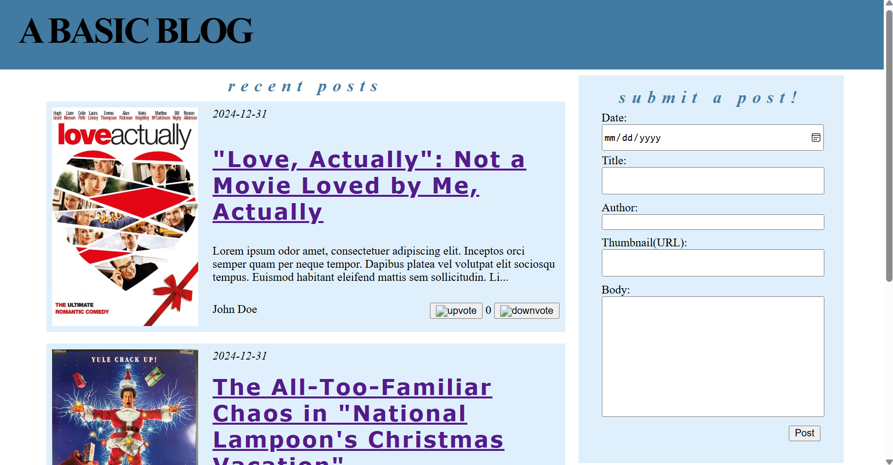
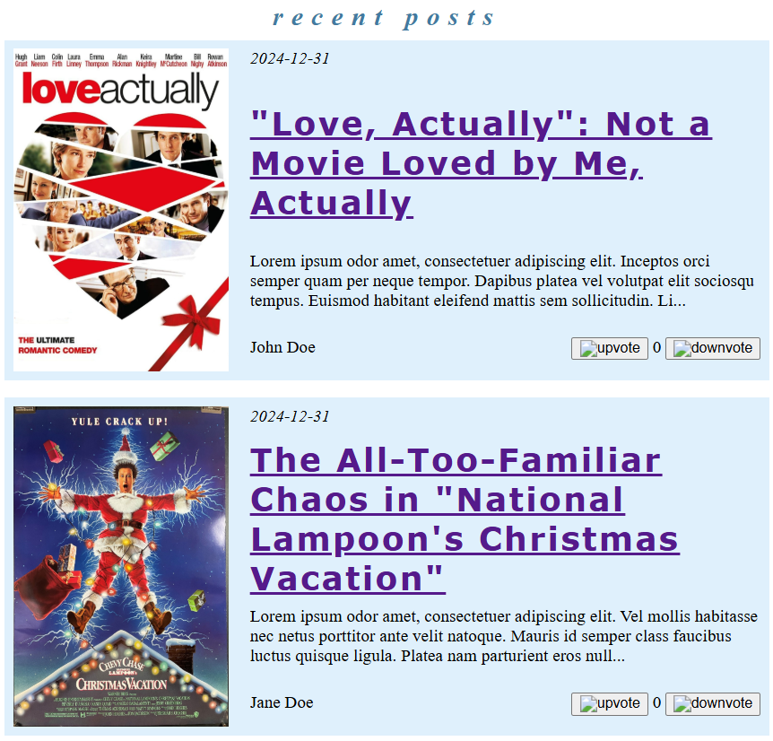
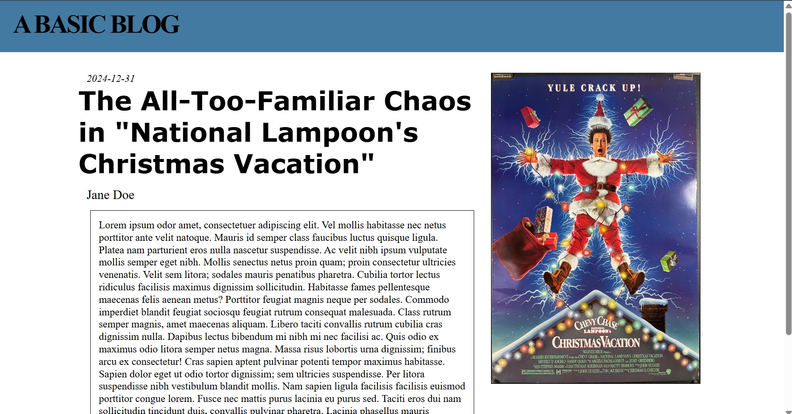
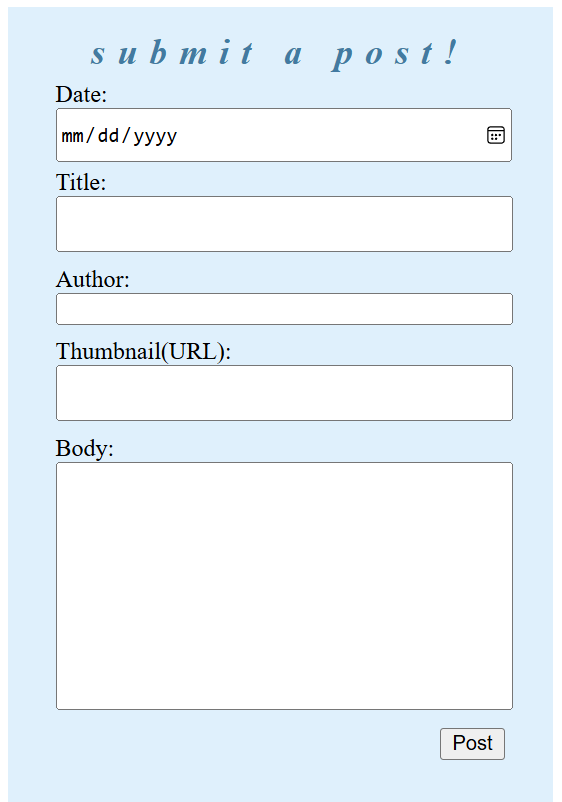
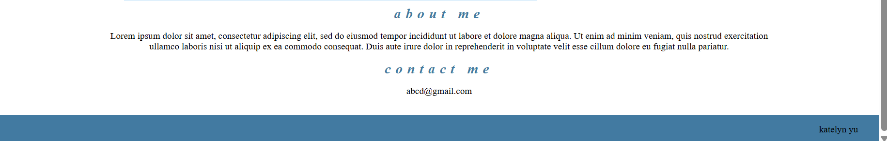

# A BASIC BLOG

# About

A basic blog web app to showcase the concepts taught by centralized-intern-training repository (https://github.com/uclaacm/centralized-intern-training.git).



# Getting Started

__The site has -not- been deployed yet. Will do as soon as possible.__

## On Local Machine

Clone this repository using this link: https://github.com/yu-kate/intern-training.git
```
git clone https://github.com/yu-kate/intern-training.git
```

Run the app (in development mode):
```
yarn start
```

Now, open http://localhost:3000

# Structure

The main component `Blog` (in src/App.tsx) calls upon all the other components described in the next section.

In `Blog`, every post's content is stored in an array `blogContent` using React's `useState` hook. When a post is submitted, its content is added to `blogContent` and `PostList` is changed and a new link is generated to its unique `PostPage`. 

To preserve the user's posts after refresh, [local storage is used](###Local-Storage-Utilization) due to the lack of a database.

This web-app uses React DOM's `BrowserRouter` to route the root page to `Blog` and to route each post's preview to its own [`PostPage`](###PostPage).

### Local Storage Utilization

Two functions were created to preserve submmited posts after refresh: `setSavedContent` and `getSavedContent`.

As their names suggest, `setSavedContent` uses local storage to save `blogContent` under the name "savedContent" while `getSavedContent` retrieves previously stored data under the same name "savedContent."

Two example posts are hard-coded into the page (to showcase a real post) that, when `Blog` mounts, are automatically added to the user's local storage. Each time a post is submitted, it is also added to the user's local storage.

## Subcomponents
### PostList



A flexbox (to accomodate for different poster sizes adn title lengths) that houses a post's preview. It consists of a thumbnail image, the date on which the post was submitted, the post's title, the first 200 characters of the post's main writing/body, and a likes counter.

### PostPage



The page which each post preview (in PostList) directs the user towards. Based on the post's index (the order of their posting), the page is generated to display all the same content as the preview plus the entirety of the post's writing/body. 

### LikesCounter
Simply two buttons to 'upvote' and 'downvote' a post that displays the net number of votes. To preserve the number of likes a post gets even after refresh, local storage is utilized (see the section describing this more in-depth [Local Storage Utilization](####Local-Storage-Utilization))

### Input



Each input field corresponds to an element in an array that, when the post is submitted, is then added to the web-app's main array `blogContent`.

### AboutContact



Just HTML for an About Me and a Contact Me section for the main page.


